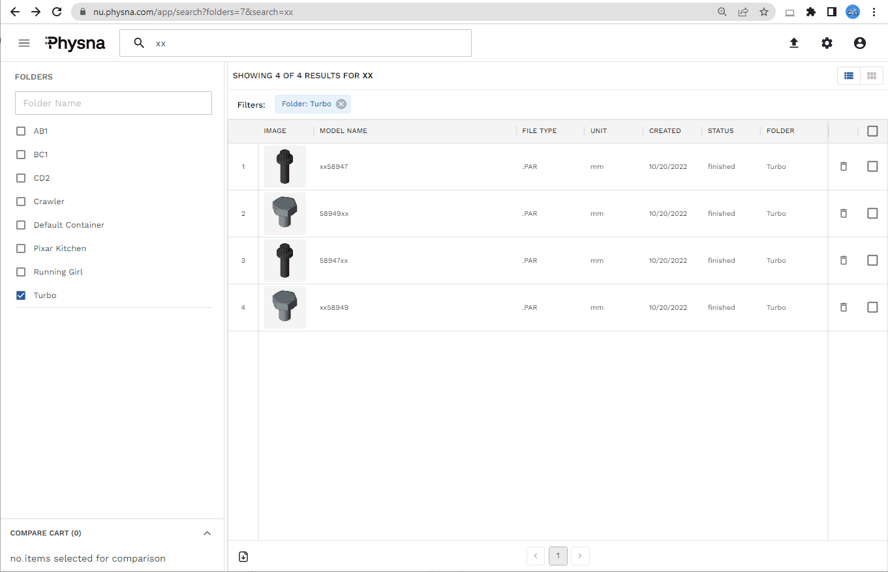

# Workshop & Training Guide v1.1

## Overview
This guide describes the features available to an End User of the Physna Enterprise Platform, a cloud-based 3D Geometric Search and Analysis solution enhanced by AI/ML. The intended audience includes anyone with access to a Physna Enterprise GUI environment who would like to:

- upload models (CAD or SCAN files of parts or assemblies)
- organize models in folders
- add or upload metadata associated to models
- search for models within other models 
- find matching models within a certain threshold of similarity
- find duplicate model
- compare models visually to detect differences and similarities

Throughout this guide you will find numbered _**Workshop Labs**_ nd _**Questions**_ crafted to demonstrate Physna's capabilities.

## Workshop Pre-requisites:

- [Chrome Browser on a PC or a Mac](https://support.google.com/chrome/answer/95346?hl=en&co=GENIE.Platform%3DDesktop)
- Read/Write access to this [progress tracker spreadsheet](https://docs.google.com/spreadsheets/d/1T5CmKvyP4t7ObUd8ZPnEy5oAN1HH5GKwL_TspGm4vK4/edit?usp=sharing). Please check that you have read/write access to it.
- 1 hour of total elapsed time to dedicate to the Workshop Steps.

---
## Table of Contents

1. [What is Physna and what is it not?](#what-is-physna)
2. [How do I access a Physna environment?](#how-do-i-access)  
   2a) [Workshop Lab 1: Login](#WorkShop_1)
3. [Navigating the Physna User Interface](#navigating-the-ui)  
   3a) [Main Landing Page](#Main_Landing_Page)  
   3b) [Workshop Lab 2: Main Page](#WorkShop_2)  
   3c) [Workshop Lab 3: Model Ingestion](#Workshop_3)  
4. [3D Geometric Search](#3D_Geometric_Search)  
   4a) [Workshop Lab 4: Find Matches](#Workshop_4)  
   4b) [Workshop Lab 5: Advanced Comparisons](#Workshop_5)  
   4c) [Workshop Lab 6: The USD File Format](#Workshop_6) 
5. [Help and Support](#help_and_support)
6. [Architecture](#architecture)
7. [Security](#security)
   1) [Security Fundamentals](#fundamentals)
   2) [Compliance and Certifications](#compliance)
   3) [Cookies](#cookies)
   4) [User Management](#user_management)

---
## 1. What is Physna and what is it not?
- Physna Enterprise is a cloud-based tool that employs patented 3D geometry-based algorithms and AI/ML neural networks to search, match and compare 3D models.
- Physna is not a CAD, PDM or PLM tool. It works alongside these tools.
- Physna is an API-driven PaaS (Platform as a Service). It exposes its functionality as [APIs](https://physna.github.io/public-api-guide/) that can be used to integrate Physna's functionality and enhance existing applications that support your company's business processes.

---
## 2. How do I access a Physna environment?
- Use [Google's Chrome Browser](https://support.google.com/chrome/answer/95346).
- The Login Page comes with links in case you forget your username or password.
- Your username is your business email address.

<kbd></kbd>

- When you first access a Physna Environment, you will be asked to set preferences and to accept the storing of cookies on your device.
- If your username has yet to be created, please refer to the [User Management](#user_management) section of this User Guide to understand the steps a System Administrator needs to execute in order to create an account for you.

### 2a. Workshop Lab 1: Logging in

1. Provide a valid email address to your Physna point of contact and ask him/her to create your user account. Your username will be your email.
2. Check your email inbox for an email from Okta and follow its instructions to complete the Okta registration process.
   For more details, you will find the process described in [Section 2](#how-do-i-access) and in the [User Management](#user_management) section of this document.
3. Log into your Physna environment: https://nu.physna.com. If you encounter any issues, please ask for assistance.
4. If you were able to successfully log into Physna, please update the [progress tracker spreadsheet](https://docs.google.com/spreadsheets/d/1T5CmKvyP4t7ObUd8ZPnEy5oAN1HH5GKwL_TspGm4vK4/edit?usp=sharing) with an "x" in the row and column that corresponds to your Workshop Lab 1.  
5. Congratulations: you have completed _Lab 1_ of the Workshop.

_Workshop Tip: when asked to click on a URL on this page, it will often be better to right-click and open the link using a new Tab to not lose where you are in this document._

---
## 3. Navigating the Physna User Interface<a name="navigating-the-ui"><a/>
   
- This section covers the main page of Physna's UI and all its features. 
- Once familiarized with the features available, you will have a Workshop Lab to reinforce what has been described.
- Depending on your user role and the set of features your company has subscribed to use, menu items shown in this document may not be active or available to you.
- Physna's UI is being actively updated to use React. Some features are still based on an older UI design that is being deprecated, but the functionality has been tested and will not affect the Workshop Labs. 

### 3a. Main Landing Page

- The main landing page, as seen below, is packed with features that are one click away from delivering great insights into your 3D models.

<kbd></kbd>

- Let's dive into the main landing page features using the annotated diagram shown below. Please follow the sequence of numbers and their descriptions:<a name="Commented_Main_Page"><a/>

<kbd></kbd>

1. The search bar is for case-insensitive searches of partial or complete names of models, filenames, or metadata elements about the models. In the example above, the end user searched for "xx" and the results show all the models that contain "xx" in their names.
2. The triple horizontal lines open or close the sub-menu of advanced features and file management options that will be explained in a subsequent section of this user guide.  
3. The question mark icon opens a _"Match Type"_ help screen that explains the 4 modalities of searches directly available to the end user from the main landing page.
    
    (i) Match: finds models that are geometrically similar to a chosen model.
   
    (ii) Part Match: finds models that contain your chosen model.
   
    (iii) Scan Match: compares models volumetrically and is useful when dealing with a high poly, scanned model. 
   
4. The radio buttons are used to switch the results between the 3 main modalities of searches available to the end user. The numbers between brackets indicate the number of hits, within the match tolerance (default value: 80%) specified immediately below. 
5. The match tolerance between 0 and 100% is used to filter the search result set.
6. The model chosen as the subject of a search query. The model selection is controlled by clicking on the "Find Matches" URL next to any model displayed on the screen.
7. The result set with Match % details, model names and the ability to change the chosen model to be used in a "Find matches" query. In this section you can also click on "Add to Compare Cart" to add any given pair of models for comparison. Comparisons will be explained in a subsequent section of this user guide.  
8. Metadata fields associated horizontally to each other and to model in the same row. The titles of the columns can be dragged and moved, hidden, and pinned to the left or the right of the displayed.

<kbd></kbd>

9. The Comparison Cart is used to compare two models. The models listed in the compare section can be cleared out from the cart or each model can be individually removed from the cart using the "x" next to it. Comparisons will be explained in a subsequent section of this user guide.
10. Download the contents of the page into an Excel-friendly format.
11. Pagination control when the result sets can't be shown on a single page.
12. The three icons, in order from left to right, represent functionality that will be explained in a subsequent section of this user guide.
  
    (i) Upload models
  
    (ii) General settings
   
    (iii) User settings
    
13. The ability to toggle the display of results between the tighter table format shown above and the bigger thumbnails format shown below.

<kbd></kbd>

### 3b. Workshop Lab 2

In preparation for this Workshop Lab, a folder named [Turbo](https://nu.physna.com/app/search?folders=7) was created on your environment and a [Turbocharger.asm](https://nu.physna.com/app/models/978db9df-1d8d-4701-99c3-014554a81b54) 3D Assembly was uploaded to it. Note the fact that these are [deep links](https://en.wikipedia.org/wiki/Deep_linking). Any model or query in Physna is represented by a URL that can be copied and shared with colleagues for ease of collaboration. 

1. Please click on the following [Turbo Folder](https://nu.physna.com/app/search?folders=7) link. You should see the contents of the _**Turbo**_ folder. Using the search bar at the top of the page, type _**xx**_ in the search box. Press the _**"return/enter"**_ key to initiate a search. 
   
   Any models with names that contain _**xx**_ and any models with metadata that contains _**xx**_ will be listed for you as shown in the animation below. Note that the query results are limited to the contents of the [Turbo Folder](https://delta.physna.com/app/search?folders=38) per the example shown below:
   
<kbd></kbd>
   
2. Now look for the **_thumbnail_** of model **_xx58949_** and click on it to see the model viewer page of this specific model, as shown in the animation below. The animation shows additional features of the model viewer page such as metadata, different visualization modes, simple commands for moving the model in all directions and for taking measurements or obtaining sectioned views.
   
<kbd></kbd>

3. The animation shown above ends with a click on the _**Find Matches**_ link at the top left-hand corner of the page, so let's click on _**Find Matches**_ to see what other models are geometric matches to model _**xx58949**_. 
   
<kbd></kbd>

4. Per the animation shown above, there are 3 types of matches offered to you. The first one is a _**3D Geometric Match**_ which is sometimes referred to as _**Match**_ or _**Part-to-Part Match**_. It helps you find models that are geometrically like each other. Observe the animation above to see where Physna places the threshold control (box #5), where the match percentages are displayed (box #7), and where the metadata is displayed (boxes #8). In this example model _**58949xx**_ matches 100% of the geometry of model _**xx58949**_. The former is out of stock and the latter is in stock, so you have found a suitable substitute for an out-of-stock part. Note that the two models come from different suppliers and have different part names. This is a common scenario among F1000 companies.
   
5. Let's now look at the _**3D Geometric Part Match**_. It's often referred to as _**Part-in-Part Match**_. Observe the animation shown below and try to repeat the same steps using your computer.
   
   <kbd></kbd>
   
   The 50 second animation shown above covered a lot of ground, so let's break it down for you:
   
   a. We started on a _**Find Matches**_ query results page where model _**xx58949**_ was used as the search criteria.  
   b. We switched the _**Match Type**_ to _**Part Match**_ by clicking on the appropriate radio button at the top left-hand corner of the screen.  
   c. The results page is refreshed to show the thumbnails and details of two assemblies that use the _**xx58949**_ bolt.   
   d. The percentage match in both cases was 100%, indicating a perfect fit.  
   e. We used the _**Add to Compare Cart**_ links to add the _**Turbocharger**_ and the _**xx58949**_ bolt to the _**Compare Cart**_.  
   f. We clicked on the _**Compare**_ button on the bottom left-corner of the search page.  
   g. The resulting _**Overview**_ comparison page allowed us to see the two models displayed side-by-side.  
   h. The _**Overlay**_ comparison page allowed us to see the intersection between the _**Turbocharger**_ and the _**Bolt**_. Physna found 8 bolts.  
   i. The _**X Ray**_ comparison page provided a visualization that is particularly useful when the difference is contained within the model.  
   
6. Let's use the [_**High Ply Scans**_](https://nu.physna.com/app/search?folders=13) folder to explain the 3rd Search _**Match Type**_: the _**Scan Match**_. 
   Per the animation below, click on this [_**High Ply Scans**_](https://nu.physna.com/app/search?folders=13) link to be taken to a folder containing models acquired using Photogrammetry. These are larger models made up of meshes with thousands of triangles. Select any one of the _**Find Matches**_ links next to the thumbnails of the various _**Impellers**_, and click on it. You should see that only the _**Scan Match**_, on the top left-hand corner of the screen, offers a non-zero result. That's because the models being compared are, from a geometrically precise perspective, very different from each other. The _**Scan Match**_ algorithm is tuned to look for shape and volumetric similarities, hence the reason for the results displayed on the screen.
   
   <kbd></kbd>   
   
The animation above culminates by showing a comparison between two models that were _**scan matched**_ due to their shape and volumetric similarities. The comparison also shows clear deep geometric differences once we get closer to the surface of the two models.
   
Question #1: How are the percentage match numbers calculated? 
   

  
Answer #1
 
   -- In the case of Match and Part-Match, Physna's algorithm looks at every internal and external geometric detail of assemblies and parts, to create input parameters used in its patented 3D geometric algorithm. If the match percentage is 100%, you can be sure of a perfect geometric match. If the match percentage is 80% or above, you can expect to see a close match. In the case of Scan-Match, shape and volumetric details take precedence in the algorithm.  

  
      
7. Please update the [progress tracker spreadsheet](https://docs.google.com/spreadsheets/d/1T5CmKvyP4t7ObUd8ZPnEy5oAN1HH5GKwL_TspGm4vK4/edit?usp=sharing) with an "x" in the row and column that corresponds to your Workshop Lab 2.
  
8. Congratulations: you have completed _Lab 2_ of the Workshop.   

### 3c. Workshop Lab 3: Model Ingestion<a name="Workshop_3"><a/>  
   
- In this section you are going to create your own folder, ingest multiple file-formats into Physna, and validate that they have been loaded correctly.
   
1. The triple horizontal lines, on the top left-hand corner of your Physna UI, can be used to open or close the sub-menu of features and file management options that will give you access to creating folders.  
   a. Click on the triple horizontal lines (hamburger menu)  
   b. Click on _**Folders**_  
   c. Click on _**Actions**_ on the top right-hand corner of the screen.  
   d. Click on _**Create New Folder**_ and create a folder unique to you. The folder name must have 3 or more alphanumeric characters. 
   
   In the animation below, we used _**AB1**_ as the folder name:  
   
   <kbd></kbd>
   
2. Physna can ingest and understand multiple file formats (3MF, ACIS, CATIA, FBX, GLTF, GLB, IGES, JT, STEP, ...). A complete list of supported file formats and caveats can be found [here](https://docs.google.com/document/d/1Bwr-YQktKb_Y3AXQRUWrCZb2mtQNvqm1-0QBexgzfkE/edit?pli=1#heading=h.50d3wyapewkj). For this step of the Workshop, please download [this zipped file](https://drive.google.com/file/d/1iF_fp_l7_B9b8BcbJAT9AOXdi36-l9i7/view?usp=sharing) to your machine. Unzip the file to a directory of your choice.

   **_Important Details:_**
     - Extracting the contents of the zipped file to a directory is a necessary step. Physna will not read the files stored within the zipped file.
     - Make sure to select **_your_** Physna folder as the destination.
     - Please _**maintain the default units as "mm"**_ and _**do not check the "deduplicate files" check box**_.
     - Please change the file filter selection to _**All Files (\*.\*)**_ before selecting the models for upload.    
   
Now that you have read the _Important Details_ above, please upload all the 17 extracted files into the Physna Folder you created in the previous step. The animation below shows the complete process described above. In the animation we're loading the 17 files into the _**AB1**_ folder. 
   
   <kbd></kbd>
   
3. The previous step ended with 17 files successfully uploaded to a folder of your choice. If this is not the case, you can ask for assistance or you can try again: make sure you have read and understood the _Important Details_ section of step 2, delete your folder (Hamburger menu > Folder > Applicable Trashcan > Red Delete Button), then start again on step 1 of this Workshop Lab.
   
4. If you are in doubt as to whether the 17 files were successfully uploaded, you can click on the _**Physna**_ logo at the top of the Physna UI, to be taken to https://nu.physna.com/app/search. You can then select your folder on the left-hand side of the page and look at the _**STATUS**_ column of the resulting list of models. _**Finished**_ under the _**STATUS**_ column means all is well.
   
Question #2: What are the possible file status values? 
   

  
Answer #2
 
   -- Physna's file ingestion pipeline goes through several phases. The sequence of phases for assemblies is:
      Incomplete-upload > Received > Unprocessed -> Missing Parts -> Satisfied -> Normalized -> Queued -> Indexing -> Indexed -> Matching -> Finished or Failed or Unsupported or Missing-Parts

    
   
5. If you would like to take a look at the original [PZ2.usd](https://drive.google.com/file/d/1ZiOkv0zhpNX0pgDHZ-UGW4_iiJUXGnVU/view?usp=share_link) file, you will need a USD Viewer. Physna is constantly updating the file types it can ingest, so you may soon be able to play directly with USD files using Physna. 
   
6. If the 17 files were successfully loaded, please update the [progress tracker spreadsheet](https://docs.google.com/spreadsheets/d/1T5CmKvyP4t7ObUd8ZPnEy5oAN1HH5GKwL_TspGm4vK4/edit?usp=sharing) with an "x" in the row and column that corresponds to your Workshop Lab 3.  
   
7. Congratulations: you have completed _Lab 3_ of the Workshop.

---
## 4. Advanced 3D Geometric Search<a name="3D_Geometric_Search"><a/>
   
- In the previous chapters we learned how to create folders, upload files, and navigate around Physna's UI using a _**Turbocharger**_ assembly, _**bolts**_, and _**High Poly Scans**_. In this chapter, we will provide examples of more complex comparisons that arise from dealing with different file formats.

### 4a. Workshop Lab 4: Find Matches<a name="Workshop_4"><a/>     
   
- In this section we will make use of the 17 files uploaded in the previous Workshop Lab.
   
1. Per the animation below, please click on the _**Physna**_ logo at the top left-hand corner of the Physna UI. This will take you to the main landing page. Then check the checkbox next to the folder containing your files.
   
   <kbd></kbd>
   
2. Scroll up and down to see all the models. Observe the different file-types ingested and understood by Physna. You should see a total of 16 models. 
   
Question #3: You uploaded 17 files so why are there not 17 models? 
   

  
Answer #3
 
   -- Because the MTL_PZ2.mtl and OBJ_PZ2.obj files work together to define a 3D model. All the other files are self-contained.

   
   
3. Per the animation below, please click on the thumbnail of _**PZ2.SLDASM**_ to open it in the main viewer page. Look at the _**Model Tree**_. This is the only file we loaded that is a proper assembly. It came with six _**.SLDPRT**_ files and Physna understood their interdependence. Observe the animation below carefully to see how Physna is aware of all the parts that compose the assembly. 
   
   <kbd></kbd>
   
4. Per the animation below, please click on the _**Find Matches**_ link that corresponds to _**PZ2.SLDASM**_ at the top left-hand corner of the viewer page. In the _**Folders**_ section of the search results page, make sure you have checked the box to limit the results to just the data you uploaded. 
    
   <kbd></kbd>
   
Question #4: Why are there 9 matches? 
   

  
Answer #4

  -- Because you uploaded 6 .SLDPRT individual puzzle pieces + 1 .SLDASM complete puzzle + 9  complete puzzles in various other formats.
  A total of 16 models were loaded but only 9 of them were complete puzzles that geometrically match the PZ2.SLDASM model used as the search criteria. 

 

5. Look for the _**Single_STL_PZ2.STL**_ file on your screen and click on its thumbnail to open its model viewer page. Try to _**explode**_ or to select sub-sections of the model, as shown in the animation below. 

   <kbd></kbd>   
   
Question #5: Why are you not able to select any of the 6 puzzle pieces seen in the previous step? 
   

  
Answer #5

  -- Because Single_STL_PZ2.STL is a monolithic model as opposed to all the other multi-body models. 

   
   
6. Click on the _**Find Matches**_ link of the _**Single_STL_PZ2.STL**_ model, at the top left-hand corner of the page. In the _**Folders**_ section of the search results page, make sure you have checked the box to limit the results to just the data you uploaded. Observe that, even though the _**Single_STL_PZ2.STL**_ model is a monolithic STL file, Physna matches it to its 9 siblings because they have very similar geometries.
   
    <kbd></kbd>  
   
7. Let's go back to the _**PZ2.SLDASM**_ model. Click on the _**Find Matches**_ link next to the thumbnail of the _**PZ2.SLDASM**_ model. In the _**Folders**_ section of the search results page, make sure you have checked the box to limit the results to just the data you uploaded. Now select the _**Part Match**_ radio button under the _**Match Type**_ section of the page (at the top left-hand corner of your window). 
   
     <kbd></kbd>    

 Question #6: What do the _**Forward Match**_ and _**Reverse Match**_ % numbers represent?
   
 

  
Answer #6

  -- The Reverse Match values are all 100% because each puzzle piece fits perfectly in the PZ2.SLDASM model.
     The Forward Match values show how much each puzzle piece represents of the complete PZ2.SLDASM model. The Forward Match %s add up to 100%. 

   
   
 8. As shown in the animation below, please click on the _**Find Matches**_ link of the _**PZ2-01**_ model. In the _**Folders**_ section of the search results page, make sure you have checked the box to limit the results to just the data you uploaded. Select the _**Part Match**_ radio button under the _**Match Type**_ section of the page and adjust the _**Match Tolerance**_ threshold down to _**40%**_.
   
    <kbd></kbd>  
   
 Question #7: What do the _**Forward Match**_ and _**Reverse Match**_ % numbers represent?
   
 

  
Answer #7

  -- The Forward Match values show how much of the PZ2-01 puzzle piece can be found in each of the 10 complete puzzles.
     The Reverse Match values show how much the PZ2-01 puzzle piece represents of each complete puzzle model.

      
   
 Question #8: When using [one of the puzzles](https://nu.physna.com/app/matches/978b18e1-134c-4b3b-9bd2-60d6a3804c0a?folders=4) to search for geometrically similar models, we see match percentages ranging from 94% to 100%. The shapes of the puzzles look identical to each other, so why don't we see 100% matches in every case? 
   
 

  
Answer #8

  -- Different file formats encode their data in different ways, producing files of different sizes. Some of the formats encode shapes using polygonal meshes, others use formulas/parametric curves, and some formats offer support for both types of encoding. Some file formats are based on open standards and were designed for ease of data exchange, and some formats are of a proprietary nature. Physna's engine has to read and interpret each file format, and their differences sometimes lead to minor discrepancies. As an end-user, you want Physna to relate all the models of puzzles to each other, no matter the file format or file name. When the match percentage is not 100%, you can compare two models and Physna will show you where the differences in the meshes occur.
  
  |File Name	|	Size (KB)	|	Triangles	|	Faces	|	Bodies	|	Parts	|	Geometry	|	Colors	|
|---	|	---	|	---	|	---	|	---	|	---	|	---	|	---	|
|3MF_PZ2.3mf	|	5	|	228	|	6	|	6	|	6	|	Tessellated	|	Yes	|
|OBJ_PZ2.obj	|	8	|	228	|	6	|	6	|	6	|	Tessellated &  NURBS |	Yes	|
|Single_STL_PZ2.stl	|	12	|	228	|	1	|	1	|	1	|	Tessellated	|	No 	|
|FBX_PZ2.fbx	|	22	|	228	|	6	|	6	|	1	|	Tessellated & NURBS |	Yes	|
|STL_PZ2.stl	|	44	|	228	|	6	|	6	|	1	|	Tessellated	|	No 	|
|JT_PZ2.jt	|	63	|	228	|	76	|	6	|	6	|	Tessellated & NURBS	|	Yes	|
|PZ2.SLDASM	|	80	|	228	|	76	|	6	|	6	|	Tessellated & NURBS	|	Yes	|
|STEP_PZ2.stp	|	102	|	228	|	76	|	6	|	6	|	Tessellated & NURBS	|	Yes	|
|X_T_PZ2.x_t	|	112	|	228	|	76	|	6	|	1	|	Parasolid B-Rep 	|	Yes	|
|IGES_PZ2.igs	|	170	|	228	|	76	|	6	|	6	|	B-Rep	|	Yes	|

  -- 

9. Please update the [progress tracker spreadsheet](https://docs.google.com/spreadsheets/d/1T5CmKvyP4t7ObUd8ZPnEy5oAN1HH5GKwL_TspGm4vK4/edit?usp=sharing) with an "x" in the row and column that corresponds to your Workshop lab 4.  
   
10. Congratulations: you have completed _Lab 4_ of the Workshop.

   

### 4b. Workshop Lab 5: Advanced Comparisons<a name="Workshop_5"><a/>     
   
- Let's take a closer look at the Comparison Tool: Overview, Overlay and X-Ray.
   
1. As shown below, click on the following link [Advanced Comparisons Folder](https://nu.physna.com/app/search?folders=15).
   
   a. Click on the _**Find Matches**_ link next to the _**ico**_ model.

    <kbd></kbd>  
   
   b. Notice that _**ico**_ is an 88.62% geometric match to _**dod**_
  
2. Let's get Physna to show us the differences and similarities between the two models. Per the animation shown below:
   
   a. If the _**Compare Cart**_ is full, please click on the _**Clear**_ link.  
   
   b. Add both the _**ico**_ and the _**dod**_ to the compare cart using their respective _**Add to Compare Cart**_ links. Order does matter to the model alignment algorithm, so please pick _**ico**_ first, then **_dod_**, as you add them to the _**Compare Cart**_, and then click on _**Compare**_.  
   
   c. Using the _**Overview**_ mode with the _**Synchronize Cameras**_ box checked or unchecked, depending on the models' relative positions, move the models around to see if you can detect the differences.  
   
      _Tip:  You should already be comfortable using the left and right buttons as well as the scroll wheel on your mouse when manipulating models on the screen. Try placing your mouse pointer over the solid cube, then click and hold the middle button on your mouse to see how you can manipulate the model_  

   
     <kbd></kbd>  

 Question #9: What did the Comparison in _**Overview**_ mode allow you to see?
   
 

  
Answer #9

  -- Files ico and dod seem to have very similar models placed in different positions and orientations.
     The cubes seem very similar but there's an icosahedron in ico and a dodecahedron in dod.

 

   
3. Now switch to _**Overlay**_ mode by clicking on the word _**Overlay**_  and do the following steps, per the animation shown below:

   a. There are six checkboxes to the left of your screen. Keeping the six checkboxes in their default setting, move the resulting model around. As you can see in the animation below, Physna auto-aligned _**ico**_ to _**dod**_ by placing the solid cubes in the same position and orientation. 
   
   b. You can see [Z-fighting](https://en.wikipedia.org/wiki/Z-fighting) between the two solid cubes, as you move all the objects around. The choice of auto-alignment indicates that the solid cubes are identical or, at least, close to 100% matches.  
   
   c. Unselect all the checkboxes except for the first one. As expected, you should see _**ico**_ by itself.  
   
   d. Switch to just having the 2nd checkbox selected. No surprises, you should see _**dod**_ by itself. Note that the solid cubes were placed in the same location with the same orientation.  
   
   e. The 3rd checkbox _**Difference ico**_ checked by itself shows the icosahedron, that is, the object that _**ico**_ contains, and _**dod**_ does not.  
   
   f. The 4th checkbox _**Difference dod**_ checked by itself shows the dodecahedron, that is, the object that _**dod**_ contains, and _**ico**_ does not.  
   
   g. The 5th checkbox, checked by itself, shows the items in _**ico**_ that are common to _**dod**_ from the perspective of _**ico**_.  
   
   h. The 6th checkbox, checked by itself, shows the items in _**dod**_ that are common to _**ico**_ from the perspective of _**dod**_.  
   
   i. Checking only the 1st and 5th checkboxes, you should see the _**ico**_ model with its cubes highlighted in yellow because they are the _**intersection**_ or  common elements shared with _**dod**_.  
   
   j. Checking only the 2nd and 6th checkboxes, you should see the _**dod**_ model with its cubes highlighted in a golden-yellow color because they are the _**intersection**_ or common elements shared with _**ico**_. In this case, the golden-yellow color can be made more prominent by changing the opacity of the _**dod**_ model, as shown in the animation below.  
 
   
 <kbd></kbd>   

   
 Question #10: Did the _**Overlay**_ mode of comparison help confirm the similarities and differences between the models?
   
 

  
Answer #10

  -- Yes, it confirmed our answer to question #9. The additional "noise" seen when the 3rd and 4th checkboxes were selected also indicated that the cubes were not 100% identical to each other across the two models: ico and dod. Note that Physna was able to compare the correct pair of cubes to each other even though their relative positions and orientations were completely different.

        

4. The answer to Question #10 can be more clearly seen when you follow the steps below, per the animation that follows: 

   a. Using the search bar, type in _**AEIOU**_ and click "Enter/Return" on your keyboard.  
   b. Click on _**Find Matches**_ next to the _**AEIOU**_ thumbnail. You should see an 82.34% match the _**UBUNTU**_ model.  
   c. Clear the _**Compare Cart**_ and add both _**UBUNTU**_ and _**AEIOU**_ to the _**Compare Cart**_, then hit _**Compare**_.  
   d. Now use the checkboxes, as you did before and as shown below, to see what letters _**AEIOU**_ and _**UBUNTU**_ share.  
   
 <kbd></kbd>    
      
 Question #11: What do we call the finding of 3 U's when intersecting AEIOU with UBUNTU?
   
 

  
Answer #11

  -- "Multi-Match". You also saw "Multi-Match" in action when we found 8 bolts in the turbocharger.

    

5. Let's move on to the _**X-Ray**_ mode of comparison. Per the animation shown below, please:

   a. Using the search bar, type in _**TESLA**_ and click "Enter/Return" on your keyboard.  
   b. Click on _**Find Matches**_ next to the _**Tesla Valve**_ thumbnail.  
   c. You will need to lower the _**% Match Tolerance**_ to find _**Tesla Valve Not**_.  
   d. Clear the _**Compare Cart**_ and add both models: _**Tesla Valve**_ and _**Tesla Valve Not**_, then click on _**Compare**_.  
   e. Switch to _**X-RAY**_ mode.  
   f. Once the models have been rendered on your screen, as shown in the animation below, you _may_ need to change the value of the _**Y Translation**_ to separate the two models that have been auto-aligned by Physna.  
   g. You can clearly see that the models are not identical because of their internal 3D geometric differences.  
   h. This example shows how and why the _**X-Ray**_ mode complements the _**Overview**_ and _**Overlay**_ modes.  
   
 <kbd></kbd>    
   
   
9. Please update the [progress tracker spreadsheet](https://docs.google.com/spreadsheets/d/1T5CmKvyP4t7ObUd8ZPnEy5oAN1HH5GKwL_TspGm4vK4/edit?usp=sharing) with an "x" in the row and column that corresponds to your Workshop Lab 5.  
   
10. Congratulations: you have completed _Lab 5_ of the Workshop.

### 4c. Workshop Lab 6: The USD File Format<a name="Workshop_6"><a/>     
   
- You can convert USD files into STL and GLB formats in preparation for ingestion into Physna.  
  The processes for file conversion are documented with examples at:
   
  a. [https://github.com/rm511130/usd2glb](https://github.com/rm511130/usd2glb/blob/main/README.md) (with color)   
  b. [https://github.com/rm511130/usd2stl](https://github.com/rm511130/usd2stl/blob/main/README.md) (no color)   
   

  1. The following animation shows the complete process for converting a USD file into GLB format.

  
  2. Let's take a look at a few other examples of USD encoded files that were converted to GLB and uploaded into Physna. The steps below are followed by their animation:
   
     a. Please click on the following link: [Pixar Kitchen](https://nu.physna.com/app/models/978df6d0-2571-477d-ba0f-db87ddaed640)  
     b. Now click on _**Find Matches**_ at the top left-hand corner and then click on the _**Part Match**_ radio button.  
     c. Clear the _**Compare Cart**_ if it's not empty and add _**kitchen**_ and _**polySurface63**_ to the _**Compare Cart**_.  
     d. Click on _**Compare**_ and switch to _**Overlay**_ mode to see where the _**polySurface63**_, a.k.a. table legs, show up in the kitchen.  
     e. Hit your browser's _**Back Button/Arrow**_ to take you back to the previous page where the _**kitchen**_ was used as the search criteria.  
     f. Now look for _**pSphere53**_. It's a _**pasta strainer**_ that shows up as one of the first few matches when you are in _**Part Match**_ mode.  
     g. Take _**polySurface63**_ off the compare cart by clicking the _**x**_ next to it, and add _**pSphere53**_ to the compare cart.  
     h. Click on _**Compare**_ and switch to _**Overlay**_ mode to see where the _**pasta strainer**_ can be seen in the kitchen.  
   
 
   
 9. Please update the [progress tracker spreadsheet](https://docs.google.com/spreadsheets/d/1T5CmKvyP4t7ObUd8ZPnEy5oAN1HH5GKwL_TspGm4vK4/edit?usp=sharing) with an "x" in the row and column that corresponds to your Workshop lab 6.  
   
10. Congratulations: you have completed _Lab 6_ of the Workshop. You can now start to experiment by yourself with Physna because _Lab 6_ was the last Lab in this workshop.  
   
---------------------------   
## 5. Help and Support <a name="help_and_support"><a/>

- You can find the details on how to contact the support team at Physna from the main hamburger menu on the main page. Click on the three horizontal lines icon to open the menu and select "Support" last item in the list. This will open a page explaining how to get in touch.

- Alternatively, you can send an e-mail to [info@physna.com](mailto:info@physna.com?subject=Physna%20Support) with the subject "Support".

- If you have a critical issue that requires immediate attention, please contact your Physna Account Team.

## 6. Architecture <a name="architecture"><a/>    
    
- Physna is a cloud-based platform installed as an isolated single tenant to guarantee complete control and isolation of your work and valuable data. The architecture diagram shown below represents all the key services used by Physna. 
    

    
- Physna is only available on GCP (Google Cloud Platform). Physna's API-first architecture means that the Cloud Service Provider hosting Physna's services is effectively shielded by a layer of Physna's Public API services. As an end user, you will not be directly exposed to the Cloud Service Provider's services and will therefore not need to manage them. 
- The documentation pertaining to the publicly available API calls can be found at  https://api.physna.com/v2/docs.
    
## 7. Security <a name="security"><a/>     
    
### Physna's Security Fundamentals <a name="fundamentals"><a/>  
    
- **Trusted cloud infrastructure**: Physna leverages GCP's secure-by-design infrastructure, built-in protection, and global network to protect your information, identities, applications, and devices. Our stack builds security through progressive layers that deliver true defense in depth at scale.
    
- **Encryption by default, at rest and in transit**: we encrypt data in transit and at rest, ensuring that it can only be accessed by authorized roles and services with audited access to the encryption keys.
    
- **Continuous Availability**: horizontal scalability of microservices allied to an infrastructure designed to exacting standards of performance, resilience, availability, correctness, and security. Physna takes advantage of native, high availability Google features and services to maintain a highly available solution.
    
- **Compliance**: policies and auditable procedures are key to the security of your users and your data.

### Compliance and Certifications <a name="compliance"><a/>

- **Current State**:

    **a) _General Data Protection Regulation (GDPR)_:** Physna is [GDPR](https://gdpr-info.eu/) compliant and can therefore offer solutions to European countries. The key characteristics of being GDPR compliant can be summarized as follows:
   1) Awareness and Communication: ensure Physna employees understand GDPR and communicate with service and staff about why you are collecting the data.
   2) Analysis of Personal Data: analysis of a list of all sensitive data that Physna stores and processes.
   3) Review Procedures: have a suitable privacy policy in place and review it regularly.
   4) Access Rights: list what access rights should be granted and how changes should be managed.
   5) Customer Consent: ensure Physna's customers consent to the processing of their data.
   6) Data Breaches: create and implement a procedure for handling data breaches.
   7) Impact assessment: conduct a data protection impact assessment.
   8) Data Protection Officers (DPO's): have an identified DPO.

    **b) _SOC 2 (System and Organization Controls)_:** Physna is [SOC 2 Type 1](https://www.vanta.com/paid/soc2) compliant and is working through the process to attain SOC 2 Type 2 compliance. SOC 2 is the most sought-after security framework for SaaS companies because it demonstrates a company's ability to effectively safeguard the privacy and security of customer and client data. SOC 2 involves:
   1) Continuous Monitoring
   2) Reliable Alerts
   3) Secure Cloud Infrastructure Configuration
   4) Laptop and Desktop Management
   5) Vendor Management
   6) Policy Templates for Business Practices
   7) Security Reports
   9) Auditor Partner Network

- **Work in Process**:   
   
    **a) _NIST 800-171_:** Physna is working towards being NIST SP800-171 or just 800-171 compliant. NIST 800-171 is a codification of the requirements that any non-Federal computer system must follow to store, process, or transmit Controlled Unclassified Information (CUI) or provide security protection for such systems. The exact requirements for NIST SP 800-171 revision 2 can be found at https://nvlpubs.nist.gov/nistpubs/SpecialPublications/NIST.SP.800-171r2.pdf. NIST SP 800-171 compliance is currently required by some Department of Defense contracts via DFARS clause 252.204-7012. The DoD Office of Sponsored Programs verifies and ensures that NIST 800-171 requirements are applicable. The key requirements fall into the following 14 categories.
   1) Access Control    
   2) Awareness and Training    
   3) Audit and Accountability    
   4) Configuration Management   
   5) Identification and Authentication    
   6) Incident Response    
   7) Maintenance    
   8) Media Protection     
   9) Personnel Security    
   10) Physical Protection    
   11) Risk Assessment     
   12) Security Assessment    
   13) System and Communications Protection   
   14) System and Information Integrity

    **b) _Cybersecurity Maturity Model Certification (CMMC)_:** Physna is working to attain CMMC Level 2 compliance. The DoD's Cybersecurity Maturity Model Certification (CMMC) program, which is related to NIST SP800-171, but contains 3 different levels, has additional controls, and requires showing a maturity level. Being CMMC compliant requires that companies entrusted with national security information implement cybersecurity standards at progressively advanced levels, depending on the type and sensitivity of the information. The program also sets forward the process for information flow down to subcontractors.    
   1) CMMC level 1: Safeguard federal contract information.
   2) CMMC level 2: Serve as a transition step in cybersecurity maturity progression to protection controlled unclassified information.
   3) CMMC level 3: Protect CUI.
   4) CMMC levels 4-5: Protect CUI and reduce the risk of advanced persistent threats
    
    **c) _NIST 800-53_:** Physna is working to attain NIST 800-53 compliance - the requirements are designed to provide a foundation of guiding elements, strategies, systems, and controls, which can agnostically support any organization’s cybersecurity needs and priorities. By establishing a framework available to all, it fosters communication and allows organizations to speak using a shared language. NIST 800-53 does not specifically support or suggest specific tools, companies, or vendors (intentionally so); it’s designed to be used as new technologies, systems, environments, and organizational changes arise, shifting cybersecurity needs. The NIST 800-53 framework provides different controls and guidance across multiple security and access control families defined under a baseline of impact: low, medium, and high. The controls are then designated across 20 security and control families:
   1) AC (Access control): Account management and monitoring, enforcing the policy of least privilege principle, and separation of duties.
   2) AT (Awareness and training): Providing awareness and security training to employees, and elevated technical training for more privileged users.
   3) AU (Audit and accountability): Auditing records and content, retaining records, and providing associated analysis and reporting
   4) CA (Assessment, authorization, and monitoring): Penetration testing, and monitoring connections to public networks and external systems 
   5) CM (Configuration management): Implementing configuration change controls, and setting authorized software policies
   6) CP (Contingency planning): Establishing and testing business continuity strategies, as well as alternate processing and storage sides.
   7) IA (Identification and authentication): Managing credentials and setting up authentication policies and systems in place for users, devices, and services.
   8) IP (Individual participation): Obtaining consent and authorizing privacy policies and practices.
   9) IR (Incident response): Setting up incident response training, setting up associated monitoring, and reporting systems.
   10) MA (Maintenance): Having an ongoing system, personnel, and tool maintenance.
   11) MP (Media protection): Securing and protecting media access, use, storage, and transportation.
   12) PA (Privacy authorization): Setting policies for collecting, using, and sharing personally identifiable information (PII)
   13) PE (Physical and environmental protection): Ensuring access to emergency power, securing physical access, and protecting against physical risk and damage.
   14) PM (Program management): Having defined strategies for risk management, insider threats, and scaling architecture.
   15) PL (Planning): Having strategies in place for comprehensive security architecture (such as defense in depth and third-party vendor security)
   16) PS (Personnel security): Screening internal and external personnel, setting up termination and transfer security policies.
   17) RA (Risk assessment): Scanning vulnerabilities, having ongoing privacy impact, and risk assessments.
   18) SA (System and services acquisition): Implementing security across the system development lifecycle, new vendor contracts, and acquisitions.
   19) SC (System and communications protection): Partitioning applications, implementing cryptographic key management, and securing passwords and other sensitive data.
   20) SI (System and information integrity): Implementing system monitoring, alerting systems, and flaw remediation processes.
  
- **Roadmap Items**:   
   
    **a) _FedRAMP (Federal Risk and Authorization Management Program)_:** Physna's certification and compliance roadmap will get to FedRAMP Levels 1 and 2. To attain FedRAMP compliance Physna will be working through the following steps:
    1) Gap analysis to understand how the current “as-is” environment aligns to the FedRAMP security requirements.
    2) Confirm executive leadership buy-in and the support of all stakeholders familiar with SOC, ISO, CMMC, and other standards.
    3) Find an Agency partner that will issue an “Authorization to Operate” (ATO). The ATO is the official management decision given by a senior Federal official to authorize operation of an information system and to explicitly accept the risk to agency operations. The natural Agency partner to work with for a FedRAMP authorization is one that is using your product or is committed to using your product.
    4) Define Physna's boundary: An authorization boundary describes a cloud system’s internal components and connections to external services and systems and accounts for the flow of all federal information and metadata through the system. It illustrates a CSP’s (Cloud Service Provider) scope of control over the system in addition to any system components or services that are leveraged from external services or controlled by the customer. As a core component of any FedRAMP System Security Plan (SSP), it is imperative that CSPs understand how to accurately describe and illustrate their cloud system’s authorization boundary. 
    5) Approach FedRAMP as a continuous program: the initial authorization represents a major milestone, but only represents a system’s risk posture at a single point in time. Security applies throughout the lifecycle of a system; cloud services must be continuously monitored and kept up to date to ensure the appropriate risk posture is maintained.

### Cookies <a name="cookies"><a/>

When accessing Physna for the first time, you will be asked to accept cookies per the example shown below:
    

    
    
### User Management <a name="user_management"><a/>
    
**Physna's users can assume one of 4 user roles:**
- **Viewer:** Viewers cannot make any changes to Files, Folders or Projects; they are only able to view Files, run queries, as well as download Files and Metadata.

- **Author:** an Author can upload, edit, and delete Files. They can also add or remove Folders and Project.
    
- **Administrator:** An Administrator can add, remove, and change Users; they can change ownership of Files, Folders, and Projects, change settings, as well as perform any functions that Authors and Viewers are allowed to perform.
    
- **SA (Super Administrator)**: one or two Super Administrators must be identified per Physna environment. The SA is the only role allowed to change certain settings and parameters that affect the overall behavior of the Physna environment. For example: number of processor threads or background execution of batch functions. The role was necessary when Physna offered an on-site installation of its software. The role will soon be deprecated because Physna no longer supports on-site installations of its enterprise solution.

**Initial User Set Up**

A Physna environment is set up by Physna's Engineering team and delivered by Physna's Customer Success Team as part of an implementation engagement. This initial engagement typically includes the creation of one or two System Administrators as well as their basic administration training. The subsequent set up of additional users is performed by one of the System Administrators and completed by the end user himself/herself. The steps are as follows: 
   
   1. The System Administrator adds the new user to Physna as shown below:

   
   
   2. The new user checks for an email from Okta. It expires 7 days after being issued and can only be used once. If one attempts to use the same link for a second time, a "Token Expired" message is displayed. 
   
   
   
   3. The new user follows the Okta workflow to create a password as shown below:
   
   
   
   4. The new user will be re-directed to https://physna.com upon completion of the Okta workflow.
   5. He or she should then type in their https://my-company.physna.com address and log in for the first time.

