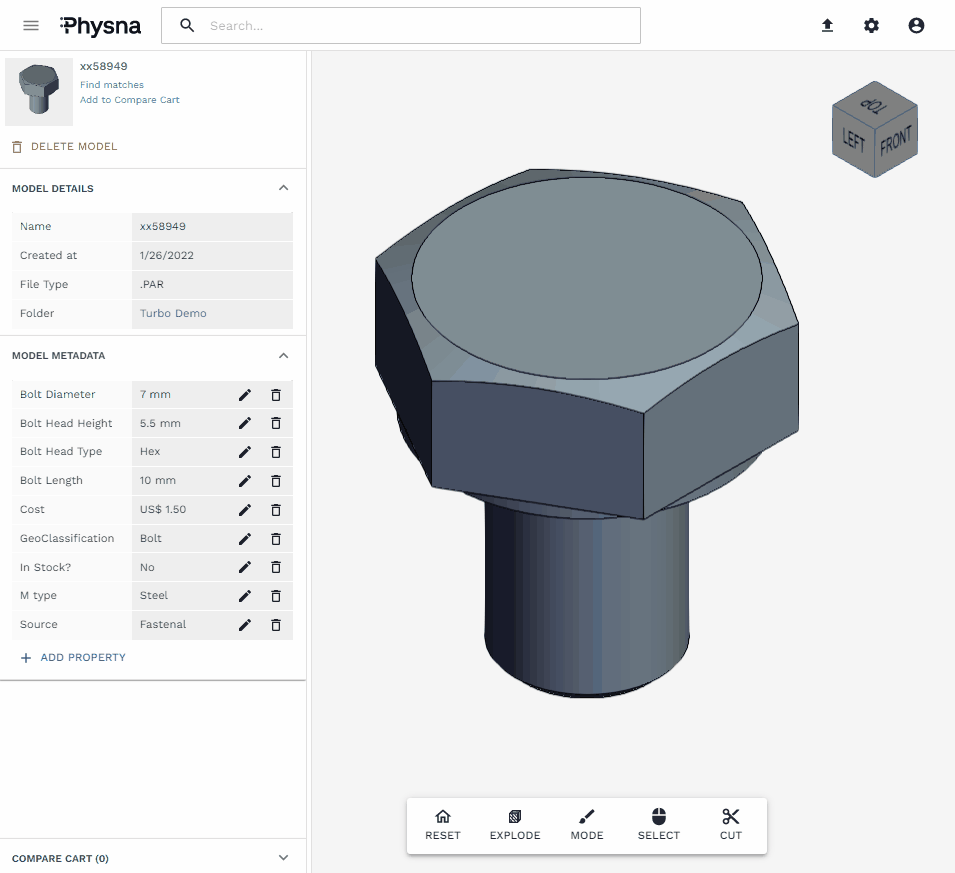
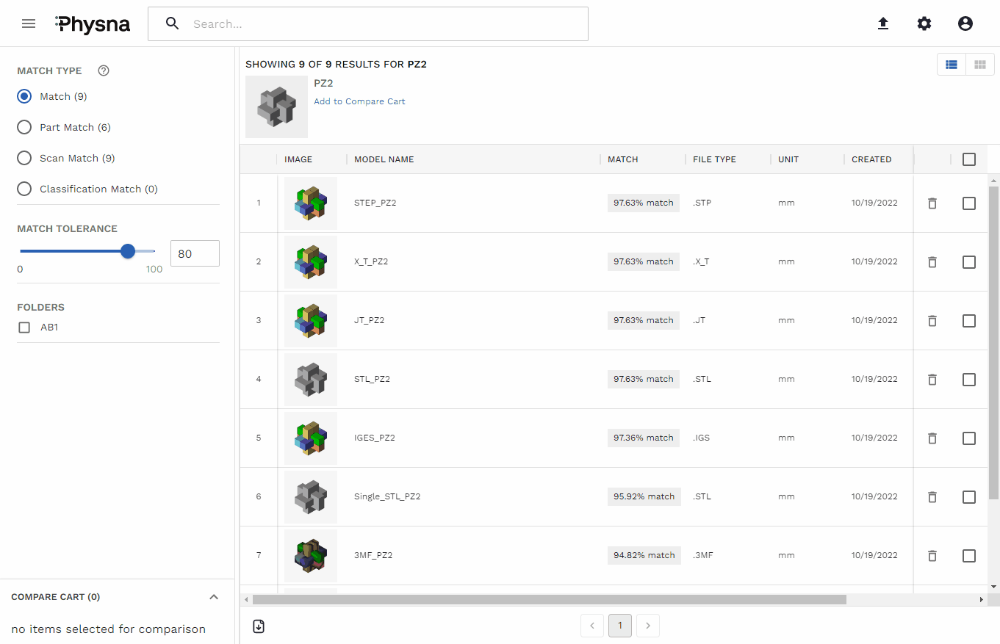

# Workshop & Training Guide v1.1

## Overview
This guide describes the features available to an End User of the Physna Enterprise Platform, a cloud-based 3D Geometric Search and Analysis solution enhanced by AI/ML. The intended audience includes anyone with access to a Physna Enterprise GUI environment who would like to:

- upload models (CAD or SCAN files of parts or assemblies)
- organize models in folders
- add or upload metadata associated to models
- search for models within other models 
- find matching models within a certain threshold of similarity
- find duplicate model
- compare models visually to detect differences and similarities

Throughout this guide you will find numbered _**Workshop Tasks**_ that have been crafted to demonstrate Physna's capabilities.

## Workshop Pre-requisites:

- [Chrome Browser on a PC or a Mac](https://support.google.com/chrome/answer/95346?hl=en&co=GENIE.Platform%3DDesktop)
- Read/Write access to this [progress tracker spreadsheet](https://docs.google.com/spreadsheets/d/1T5CmKvyP4t7ObUd8ZPnEy5oAN1HH5GKwL_TspGm4vK4/edit?usp=sharing). Please check that you do have read/write access to it.
- 1 hour of total elapsed time to dedicate to the Workshop Steps.

---
## Table of Contents

1. [What is Physna and what is it not?](#what-is-physna)
2. [How do I access a Physna environment?](#how-do-i-access)  
   2a) [Workshop Task 1: Login](#WorkShop_1)
3. [Navigating the Physna User Interface](#navigating-the-ui)  
   3a) [Main Landing Page](#Main_Landing_Page)  
   3b) [Workshop Task 2: Main Page](#WorkShop_2)  
   3c) [Folders](#Folders)  
   3d) [Uploading Files](#Uploading_Files)  
   3e) [Workshop Task 3: Model Ingestion](#Workshop_3)  
4. [3D Geometric Search](#3D_Geometric_Search)  
   4a) [Workshop Task 4: Find Matches](#Workshop_4)  
5. [Help and Support](#help_and_support)
6. [Architecture](#architecture)
7. [Security](#security)
   1) [Security Fundamentals](#fundamentals)
   2) [Compliance and Certifications](#compliance)
   3) [Cookies](#cookies)
   4) [User Management](#user_management)

---
## 1. What is Physna and what is it not?
- Physna Enterprise is a cloud-based tool that employs patented 3D geometry based algorithms and AI/ML neural networks to search, match and compare 3D models.
- Physna is not a CAD, PDM or PLM tool. It works alongside these tools.
- Physna is an API-driven PaaS (Platform as a Service). It exposes its functionality as [APIs](https://physna.github.io/public-api-guide/) that can be used to integrate Physna's functionality and enhance existing applications that support your company's business processes.

---
## 2. How do I access a Physna environment?
- Your Physna point of contact, typically an Account Executive or a Customer Success Team Member, will provide you a URL to access your firewalled, single-tenant, and encrypted Physna Environment. The URL will follow the structure __https://my-company.physna.com__ where "__my-company__" is the name you agreed to use during initial implementation discussions with Physna's Customer Success team. 
- Ask your Business/Program/Project Leader or designated System Administrator what username you should use to log into your Physna environment. It will probably be your business email address.
- Use [Google's Chrome Browser](https://support.google.com/chrome/answer/95346) for better results.
- The Login Page comes with links in case you forget your username or password.

<kbd></kbd>

- When you first access a Physna Environment, you will be asked to set preferences and to accept the storing of cookies on your device.
- If your username has yet to be created, please refer to the [User Management](#user_management) section of this User Guide to understand the steps a System Administrator needs to execute in order to create an account for you.

### 2a. Workshop Task 1

1. Provide a valid email address to your Physna point of contact and ask him/her to create your user account. Your username will be your email.
2. Check your email inbox for an email from Okta and follow its instructions to complete the Okta registration process.
   For more details, you will find the process described in [Section 2](#how-do-i-access) and in the [User Management](#user_management) section of this document.
3. Log into your Physna environment: https://nu.physna.com. If you encounter any issues, please ask for assistance.
4. If you were able to successfully log into Physna, please update the [progress tracker spreadsheet](https://docs.google.com/spreadsheets/d/1T5CmKvyP4t7ObUd8ZPnEy5oAN1HH5GKwL_TspGm4vK4/edit?usp=sharing) with an "x" in the row and column that corresponds to your Workshop Task 1.  
5. Congratulations: you have completed _Task 1_ of the Workshop.

_Workshop Tip: when asked to click on a URL on this page, it will often be better to right-click and open the link using a new Tab so as to not lose where you are in this document._

---
## 3. Navigating the Physna User Interface<a name="navigating-the-ui"><a/>
   
- This section covers the main page of Physna's UI and all of its features. 
- Once familiarized with the features available, you will have a Workshop Task to reinforced what has been described.
- Depending on your user role and the set of features your company has subscribed to use, some of the menu items shown in this document may not be active or available to you.
- Physna's UI is being actively updated to use React. Some of its features will still be based on an older UI design that is being deprecated, but the functionality has been tested and will not affect the Workshop Tasks. 

### 3a. Main Landing Page

- The main landing page, as seen below, is packed with features that are one click-away from delivering great insights into your 3D models.

<kbd></kbd>

- Let's dive into the main landing page features using the annotated diagram shown below. Please follow the sequence of numbers and their descriptions:<a name="Commented_Main_Page"><a/>

<kbd></kbd>

1. The search bar is for case-insensitive searches of partial or complete names of models, filenames, or metadata elements about the models. In the example above, the end user searched for "xx" and the results show all the models that contain "xx" in their names.
2. The triple horizontal lines open or close the sub-menu of advanced features and file management options that will be explained in a subsequent section of this user guide.  
3. The question mark icon opens a _"Match Type"_ help screen that explains the 4 modalities of searches directly available to the end user from the main landing page.
    
    (i) Match: finds models that are geometrically similar to a chosen model.
   
    (ii) Part Match: finds models that contain your chosen model.
   
    (iii) Scan Match: compares models volumetrically and is useful when dealing with a high-poly, scanned model. 
   
4. The radio buttons are used to switch the results between the 3 main modalities of searches available to the end user. The numbers between brackets indicate the number of hits, within the match tolerance (default value: 80%) specified immediately below. 
5. The match tolerance between 0 and 100% is used to filter the search result set.
6. The model chosen as the subject for the searches. The model selection is controlled by clicking on the "Find Matches" URL next to any model displayed on the screen.
7. The result set with Match % details, model names and the ability to change the chosen model to be used in a "Find matches" query. In this section you can also click on "Add to Compare Cart" to add any given pair of models for comparison. Comparisons will be explained in a subsequent section of this user guide.  
8. Metadata fields associated horizontally to each other and to model in the same row. The titles of the columns can be dragged and moved, hidden and pinned to the left or the right of the displayed.

<kbd></kbd>

9. The Comparison Cart is used to compare two models. The models listed in the compare section can be cleared out from the cart or each model can be individually removed from the cart using the "x" next to it. Comparisons will be explained in a subsequent section of this user guide.
10. Download the contents of the page into using an Excel-friendly format.
11. Pagination control when the result sets can't be shown on a single page.
12. The three icons, in order from left to right, represent functionality that will be explained in a subsequent section of this user guide.
  
    (i) Upload models
  
    (ii) General settings
   
    (iii) User settings
    
13. The ability to toggle the display of results between the tighter table format shown above and the bigger thumbnails format shown below.

<kbd></kbd>

### 3b. Workshop Task 2

In preparation for this Workshop Task, a folder named [Turbo](https://nu.physna.com/app/search?folders=7) was created on your environment and a [Turbocharger.asm](https://nu.physna.com/app/models/978db9df-1d8d-4701-99c3-014554a81b54) 3D Assembly was uploaded to it. Note the fact that these are [deep links](https://en.wikipedia.org/wiki/Deep_linking). Any model or query in Physna is represented by a URL that can be copied and shared with colleagues for ease of collaboration. 

1. You will get a chance to create folders and upload files in a few moments, but first let's experiment with how to navigate the Physna User Interface. This first step is more of a suggestion as to how you can organize your screen for advancing efficiently through the different Workshop Tasks:
 
   a. right-click on the [annotated main page diagram shown above](#Commented_Main_Page) link and open it in a new tab.
   
   b. right-click on the [Turbo Folder](https://nu.physna.com/app/search?folders=7) link and open it in yet another new browser tab.   
  
   c. You should now have at least 3 open Tabs on your browser window: 
   - _Tab 1_ is this page with the instructions you are following, 
   - _Tab 2_ is for quick access to the annotated main-page of Physna's UI, and 
   - _Tab 3_ is for Physna's UI where you will run queries and look at results.
   
   d. If you happen to be using multiple LCD monitors, go ahead and separate these three tabs so you can see them all at the same time. If you only have one LCD monitor, you can organize your tabs as shown in the animation below. Note that this is not a mandatory step, it's just a suggestion:
   
<kbd></kbd>
   
2. By clicking on [Turbo Folder](https://nu.physna.com/app/search?folders=7) you were brought to the contents of the _**Turbo**_ folder. Using the search bar at the top of the page, type _**xx**_ in the search box. Press the _**"return/enter"**_ key to initiate a search. Any models with names that contain "xx" and any models with metadata that contains "xx" will be listed for you. Note that the query results are limited to the contents of the [Turbo Folder](https://delta.physna.com/app/search?folders=38) per the example shown below:
   
<kbd></kbd>
   
3. On Tab3 (the Physna UI query page) look for the **_thumbnail_** of model **_xx58949_** and click on it to see the model viewer page of this specific model, as shown in the animation below. The animation shows additional features of the model viewer page such as metadata, different visualization modes, simple commands for moving the model in all directions and for taking measurements or obtaining sectioned views.
   
<kbd></kbd>

4. The animation shown above ends with a click on _**Find Matches**_, so let's click on _**Find Matches**_ to see what other models match model _**xx58949**_ geometrically.
   
<kbd></kbd>

5. Per the animation shown above, there are 3 types of matches that you can access. Observe the animation above carefully to see where Physna places the threshold control (box #5), where the match percentages are displayed (box #7), and where the metadata is displayed (boxes #8). The animation also shows the results of a part-in-part match: a turbocharger and an intake valve. Take the time to click around and get familiarized with the other features such as box #10 for the download of CSV formatted data and box #13 for a "shopping cart" view of the thumbnails.
   
6. Please update the [progress tracker spreadsheet](https://docs.google.com/spreadsheets/d/1T5CmKvyP4t7ObUd8ZPnEy5oAN1HH5GKwL_TspGm4vK4/edit?usp=sharing) with an "x" in the row and column that corresponds to your Workshop Task 2.
  
7. Congratulations: you have completed _Task 2_ of the Workshop.   

### 3c. Folders

- Folders in Phynsa are containers that help you organize your 3D models. You can search across folders, but storing models in distinct folders provides a logical structure for organizing your data.

- To list your folders, open the hamburger menu (the triple horizontal lines) on the upper left corner and select _**Folders**_.

<kbd></kbd>

- This will display the list of folders.

<kbd></kbd>

- To create a new folder, click on the "Actions" button on the upper right corner and select _**Create  New Folder**_ from the drop-down menu.

   <kbd></kbd>

- Enter the name of the new folder and click the _**Create**_ button.

   <kbd></kbd>

- To delete a folder, click on the trashcan icon next to the folder name in the folder list page.   

### 3d. Uploading Files

- For Physna to be able to index the geometry of your 3D models, you would need to first upload all necessary files to it. The upload button is in the upper-right corner of the page as shown here:

<kbd></kbd>

- Pressing the upload button will open the upload page, as shown below:

<kbd></kbd>

- Note the various components of the upload user interface:   
   
1. Dropdown that lists all available folders in the environment and allows the user to select the target folder for the upload. The default is "Default Container"
2. Specify the units of measure (e.g., "inch", "feet", "millimeter" and "meter")
3. When checked, it will prevent the upload of duplicate files. That is, files with the same source directory and filename.
4. Pressing the "Upload Files" button will display standard file selection dialog. Choose one or more files from your local storage to be uploaded
5. List of recently uploaded files. Mostly for your information

- Clicking the "Upload Files" button will open standard file selection dialog. The way that appears will depend on your operating system. Once you confirm your file selection the file will be uploaded to Physna and indexing will be initiated. Progress bar in the right side of the page will be displayed.

<kbd></kbd>

- At this time, the model should be visible in the destination folder. Physna will proceed through several stages of processing. When the processing state reaches "Finished", the model is ready for use. You can always see the status in the folder's page.

### 3e. Workshop Task 3: Model Ingestion<a name="Workshop_3"><a/>  
   
- In this section you are going to create your own folder, ingest multiple file-formats into Physna, and validate that they have been loaded correctly using different reports and query mechanisms.
   
1. On the top left-hand corner, the triple horizontal lines can be used to open or close the sub-menu of advanced features and file management options that will give you access to creating folders as seen in [section 3c](#Folders). Go ahead and click on the triple horizontal lines (hamburger menu) and then click on _**Folders**_. Click on _**Actions**_ on the top right-hand corner of the screen, then on _**Create New Folder**_. Create a folder unique to you. The folder name must have 3 or more alphanumeric characters. You can use, for example, _**AB1**_ if your initials are _**AB**_. See animation below:
   
   <kbd></kbd>
   
2. Physna can ingest and understand multiple file formats (3MF, ACIS, CATIA, FBX, GLTF, GLB, IGES, JT, STEP, ...). A complete list of supported file formats and caveats can be found [here](https://docs.google.com/document/d/1Bwr-YQktKb_Y3AXQRUWrCZb2mtQNvqm1-0QBexgzfkE/edit?pli=1#heading=h.50d3wyapewkj). For this step of the Workshop, please download [this zipped file](https://drive.google.com/file/d/1iF_fp_l7_B9b8BcbJAT9AOXdi36-l9i7/view?usp=sharing) to your machine. Unzip the file to a directory of your choice.

   **_Important Details:_**
     - Extracting the contents of the zipped file to a directory is a necessary step. Physna will not read the files stored within the zipped file.
     - Make sure to select **_your_** Physna folder as the destination.
     - Please _**maintain the default units as "mm"**_ and _**do not check the "deduplicate files" check box**_.
     - Please change the file filter selection to _**All Files (\*.\*)**_ before selecting the models for upload.    
   
Now that you have read the _Important Details_ above, please upload all of the 17 extracted files into the Physna Folder you created in the previous step. The animation below shows the whole process described above. In the animation we're loading the 17 files into the _**AB1**_ folder. 
   
   <kbd></kbd>
   
3. The previous step ended with 17 files successfully uploaded to a folder of your choice. If this is not the case, you can ask for assistance or you can try again: make sure you have read and understood the _Important Details_ section of step 2, delete your folder (hamburger menu > folder > trash-can > Red Delete button), then start again on step 1 of this Workshop Task.
   
4. If the 17 files were successfully loaded, please update the [progress tracker spreadsheet](https://docs.google.com/spreadsheets/d/1T5CmKvyP4t7ObUd8ZPnEy5oAN1HH5GKwL_TspGm4vK4/edit?usp=sharing) with an "x" in the row and column that corresponds to your Workshop Task 3.  
   
5. Congratulations: you have completed _Task 3_ of the Workshop.

---
## 4. 3D Geometric Search<a name="3D_Geometric_Search"><a/>
   
- In the previous chapters we learned how to create folders, upload files, and navigate around Physna's UI. In this chapter, we will provide some examples of the types of practical operations one can perform using Physna.

### 4a. Workshop Task 4: Find Matches<a name="Workshop_4"><a/>     
   
- In this section we will make use of the 17 files uploaded in the previous Work Task.
   
1. Per the animation below, please click on the _**Physna**_ logo at the top left-hand corner of the Physna UI. This will take you to the main landing page. Then check the check-box next to the folder containing your files.
   
   <kbd></kbd>
   
2. Scroll up and down to see all the models. Observe the different file-types ingested and understood by Physna. You should see a total of 16 models. 
   
Question #1: you uploaded 17 files so why are there not 17 models? 
   

  
Answer #1
 
   -- Because the MTL_PZ2.mtl and OBJ_PZ2.obj files work together to define a 3D model. All the other files are self-contained.

   
   
3. Per the animation below, please click on the thumbnail of _**PZ2.SLDASM**_ to open it in the main viewer page. Take a look at the _**Model Tree**_. This is the only file we loaded that is a proper assembly. It came with six _**.SLDPRT**_ files and Physna understood their interdependence. Observe the animation below carefully to see how Physna is aware of all the parts that compose the assembly. 
   
   <kbd></kbd>
   
4. Per the animation below, please click on the _**Find Matches**_ link that corresponds to _**PZ2.SLDASM**_ at the top left-hand corner of the viewer page. In the _**Folders**_ section of the search results page, make sure you have checked the box to limit the results to just the data you uploaded. 
   
Question #2: why are there 9 matches? 
   

  
Answer #2

  -- Because you uploaded 6 .SLDPRT individual puzzle pieces + 1 .SLDASM complete puzzle + 9  complete puzzles in various other formats.
  A total of 16 models were loaded but only 9 of them were complete puzzles that geometrically match the PZ2.SLDASM model used as the search criteria. 

 
   
   <kbd></kbd>

5. Look for the _**Single_STL_PZ2.STL**_ file on your screen and click on its thumbnail to open its model viewer page. Try to _**explode**_ or to select sub-sections of the model, as shown in the animation below. 
   
Question #3: why are you not able to select any of the 6 puzzle pieces seen in the previous step? 
   

  
Answer #3

  -- Because Single_STL_PZ2.STL is a monolithic model as opposed to all the other multi-body models. 

   
   
   <kbd></kbd>

6. Click on the _**Find Matches**_ link of the _**Single_STL_PZ2.STL**_ model, at the top left-hand corner of the page. In the _**Folders**_ section of the search results page, make sure you have checked the box to limit the results to just the data you uploaded. Observe that, even though the _**Single_STL_PZ2.STL**_ model is a monolithic STL file, Physna matches it to its 9 siblings because they have very similar geometries.
   
    <kbd></kbd>  
   
7. Let's go back to the _**PZ2.SLDASM**_ model. Click on the _**Find Matches**_ link next to the thumbnail of the _**PZ2.SLDASM**_ model. In the _**Folders**_ section of the search results page, make sure you have checked the box to limit the results to just the data you uploaded. Now select the _**Part Match**_ radio button under the _**Match Type**_ section of the page (at the top left-hand corner of your window). 
   
     <kbd></kbd>    

 Question #4: what do the _**Forward Match**_ and _**Reverse Match**_ % numbers represent?
   
 

  
Answer #4

  -- The Reverse Match values are all 100% because each puzzle piece fits perfectly in the PZ2.SLDASM model.
     The Forward Match values show how much each puzzle piece represents of the complete PZ2.SLDASM model. The Forward Match %s add up to 100%. 

   
   
 8. As shown in the animation below, please click on the _**Find Matches**_ link of the _**PZ2-01**_ model. In the _**Folders**_ section of the search results page, make sure you have checked the box to limit the results to just the data you uploaded. Select the _**Part Match**_ radio button under the _**Match Type**_ section of the page, and adjust the _**Match Tolerance**_ threshold down to _**40%**_.
   
    <kbd></kbd>  
   
 Question #5: what do the _**Forward Match**_ and _**Reverse Match**_ % numbers represent?
   
 

  
Answer #5

  -- The Forward Match values show how much of the PZ2-01 puzzle piece can be found in each of the 10 complete puzzles.
     The Reverse Match values show how much the PZ2-01 puzzle piece represents of each complete puzzle model.

      
   
   
   
   
   
   
 Provided that we have uploaded our inventory of parts to Physna as described earlier and all our models are in "Finished" state, we are ready to search for similar parts. 

With large teams and/or number of models, it is often possible to produce duplicate or at least very similar designs. This occurs even in cases where the company utilizes good PLM system and practice. In such cases, we find ourselves in a situation where the same part may be registered with different part numbers and has duplicate 3D models stored.

Physna can find if a model exists based on the geometry even in cases when the metadata differs. There are several types of searches, but the simplest one is the simple "Match".

First, we navigate to the folders where our model of interest is. This could be a model that we uploaded, and we would like to know if there is some other model that matches it with certain percent of confidence.

For this example, we would like to see if "2.3 Shaft\_holder 1\_Trans Connector\_Front Axle\_Unreal Tractor\_by paX" has any models similar to it.

Selecting it from the list of models in the folder will show a context menu with links to "Find Matches" and "Add to Compare Cart". 

__NOTE: You do not need to scroll withing a folder to find your part. You can search for it by name if it is known. Enter the name in the search text field at the top of the main page to quickly navigate to the desired model.__

To find similarities, click on "Find Matches".

You can adjust the match percentage by moving the green slider bar left and right. In this example, with level of 70% we see two candidates. The first one shows match confidence of 86.88%, which indicates high level of similarity. Hovering over it will display the same options. This time, we would like to inspect visually the differences. To do that, we will click on "Add to Compare Cart" for that item.

Notice that in the lower-left corner of the screen the "Compare Cart" now contains one item.

Click "Add to Compare Cart" on the original part to also added it to the cart.

With more than one items in the cart, we now see that the "Compare" button is enabled at the bottom of the panel.

Click that button to open the Comparison Viewer.

The default view is to show both models side by side, but you can also overlay them or use the "X-Ray" model. Those views offer different controls to adjust how they are presented for best effect. For example, you can adjust the opacity of the models.

In many cases, it is sufficient to know the percentage of similarity. If it is 100%, you know that the two parts are exact duplicates even when they are registered with different names in your system. Comparing differences is most useful when you are trying to determine how and why the two are different.

## 5. Help and Support <a name="help_and_support"><a/>

- You can find the details on how to contact the support team at Physna from the main hamburger menu on the main page. Click on the three horizontal lines icon to open the menu and select "Support" last item in the list. This will open a page explaining how to get in touch.

- Alternatively, you can sent an e-mail to [info@physna.com](mailto:info@physna.com?subject=Physna%20Support) with subject "Support".

- If you have a critical issue that requires immediate attention, please contact your Physna Account Team.

## 6. Architecture <a name="architecture"><a/>    
    
- Physna is a cloud-based platform installed as an isolated single tenant in order to guarantee complete control and isolation of your work and valuable data. The architecture diagram shown below represents all the key services used by Physna. 
    

    
- Physna is only available on GCP (Google Cloud Platform). Physna's API-first architecture means that the Cloud Service Provider hosting Physna's services is effectively shielded by a layer of Physna's Public API services. As an end user, you will not be directly exposed to the Cloud Service Provider's services and will therefore not need to manage them. 
- The documentation pertaining to the publicly available API calls can be found at  https://api.physna.com/v2/docs.
    
## 7. Security <a name="security"><a/>     
    
### Physna's Security Fundamentals <a name="fundamentals"><a/>  
    
- **Trusted cloud infrastructure**: Physna leverages GCP's secure-by-design infrastructure, built-in protection, and global network to protect your information, identities, applications, and devices. Our stack builds security through progressive layers that deliver true defense in depth at scale.
    
- **Encryption by default, at rest and in transit**: we encrypt data in transit and at rest, ensuring that it can only be accessed by authorized roles and services with audited access to the encryption keys.
    
- **Continuous Availability**: horizontal scalability of microservices allied to an infrastructure designed high standards of performance, resilience, availability, correctness, and security. Physna takes advantage of native, high availability Google features and services to maintain a highly available solution.
    
- **Compliance**: policies and auditable procedures are key to the security of your users and your data.

### Compliance and Certifications <a name="compliance"><a/>

- **Current State**:

    **a) _General Data Protection Regulation (GDPR)_:** Physna is [GDPR](https://gdpr-info.eu/) compliant and can therefore offer solutions to european countries. The key characteristics of being GDPR compliant can be summarized as follows:
   1) Awareness and Communication: ensure Physna employees understand GDPR and communicate with service and staff about why you are collecting the data.
   2) Analysis of Personal Data: analysis of a list of all sensitive data that Physna stores and processes.
   3) Review Procedures: have a suitable privacy policy in place and review it regularly.
   4) Access Rights: list what access rights should be granted and how changes should be handled.
   5) Customer Consent: ensure Physna's customers consent to the processing of their data.
   6) Data Breaches: create and implement a procedure for handling data breaches.
   7) Impact assessment: carry out a data protection impact assessment.
   8) Data Protection Officers (DPO's): have an identified DPO.

    **b) _SOC 2 (System and Organization Controls)_:** Physna is [SOC 2 Type 1](https://www.vanta.com/paid/soc2) compliant and is working through the process to attain SOC 2 Type 2 compliance. SOC 2 is the most sought after security framework for SaaS companies because it demonstrates a company's ability to effectively safeguard the privacy and security of customer and client data. SOC 2 involves:
   1) Continuous Monitoring
   2) Reliable Alerts
   3) Secure Cloud Infrastructure Configuration
   4) Laptop and Desktop Management
   5) Vendor Management
   6) Policy Templates for Business Practices
   7) Security Reports
   9) Auditor Partner Network

- **Work in Process**:   
   
    **a) _NIST 800-171_:** Physna is working towards being NIST SP800-171 or just 800-171 compliant. NIST 800-171 is a codification of the requirements that any non-Federal computer system must follow in order to store, process, or transmit Controlled Unclassified Information (CUI) or provide security protection for such systems. The exact requirements for NIST SP 800-171 revision 2 can be found at https://nvlpubs.nist.gov/nistpubs/SpecialPublications/NIST.SP.800-171r2.pdf. NIST SP 800-171 compliance is currently required by some Department of Defense contracts via DFARS clause 252.204-7012. The DoD Office of Sponsored Programs verifies and ensures that NIST 800-171 requirements are applicable. The key requirements fall into the following 14 categories.
   1) Access Control    
   2) Awareness and Training    
   3) Audit and Accountability    
   4) Configuration Management   
   5) Identification and Authentication    
   6) Incident Response    
   7) Maintenance    
   8) Media Protection     
   9) Personnel Security    
   10) Physical Protection    
   11) Risk Assessment     
   12) Security Assessment    
   13) System and Communications Protection   
   14) System and Information Integrity

    **b) _Cybersecurity Maturity Model Certification (CMMC)_:** Physna is working to attain CMMC Level 2 compliance. The DoD's Cybersecurity Maturity Model Certification (CMMC) program, which is related to NIST SP800-171, but contains 3 different levels, has additional controls, and requires showing a maturity level. Being CMMC compliant requires that companies entrusted with national security information implement cybersecurity standards at progressively advanced levels, depending on the type and sensitivity of the information. The program also sets forward the process for information flow down to subcontractors.    
   1) CMMC level 1: Safeguard federal contract information.
   2) CMMC level 2: Serve as a transition step in cybersecurity maturity progression to protection controlled unclassified information.
   3) CMMC level 3: Protect CUI.
   4) CMMC levels 4-5: Protect CUI and reduce the risk of advanced persistent threats
    
    **c) _NIST 800-53_:** Physna is working to attain NIST 800-53 compliance - the requirements are designed to provide a foundation of guiding elements, strategies, systems, and controls, that can agnostically support any organization’s cybersecurity needs and priorities. By establishing a framework available to all, it fosters communication and allows organizations to speak using a shared language. NIST 800-53 does not specifically support or suggest specific tools, companies, or vendors (intentionally so); it’s designed to be used as new technologies, systems, environments, and organizational changes arise, shifting cybersecurity needs. The NIST 800-53 framework provides a number of different controls and guidance across multiple security and access control families defined under a baseline of impact: low, medium and high. The controls are then designated across 20 security and control families:
   1) AC (Access control): Account management and monitoring, enforcing the policy of least privilege principle, and separation of duties.
   2) AT (Awareness and training): Providing awareness and security training to employees, and elevated technical training for more privileged users.
   3) AU (Audit and accountability): Auditing records and content, retaining records, and providing associated analysis and reporting
   4) CA (Assessment, authorization and monitoring): Penetration testing, and monitoring connections to public networks and external systems 
   5) CM (Configuration management): Implementing configuration change controls, and setting authorized software policies
   6) CP (Contingency planning): Establishing and testing business continuity strategies, as well as alternate processing and storage sides.
   7) IA (Identification and authentication): Managing credentials and setting up authentication policies and systems in place for users, devices, and services.
   8) IP (Individual participation): Obtaining consent and authorizing privacy policies and practices.
   9) IR (Incident response): Setting up incident response training and setting up associated monitoring and reporting systems.
   10) MA (Maintenance): Having an ongoing system, personnel, and tool maintenance.
   11) MP (Media protection): Securing and protecting media access, use, storage, and transportation.
   12) PA (Privacy authorization): Setting policies for collecting, using, and sharing personally identifiable information(PII)
   13) PE (Physical and environmental protection): Ensuring access to emergency power, securing physical access, and protecting against physical risk and damage.
   14) PM (Program management): Having defined strategies for risk management, insider threats, and scaling architecture.
   15) PL (Planning): Having strategies in place for comprehensive security architecture (such as defense in depth and third-party vendor security)
   16) PS (Personnel security): Screening internal and external personnel, setting up termination and transfer security policies.
   17) RA (Risk assessment): Scanning vulnerabilities, having ongoing privacy impact, and risk assessments.
   18) SA (System and services acquisition): Implementing security across the system development lifecycle, new vendor contracts, and acquisitions.
   19) SC (System and communications protection): Partitioning applications, implementing cryptographic key management, and securing passwords and other sensitive data.
   20) SI (System and information integrity): Implementing system monitoring, alerting systems, and flaw remediation processes.
  
- **Roadmap Items**:   
   
    **a) _FedRAMP (Federal Risk and Authorization Management Program)_:** Physna's certification and compliance roadmap will ultimately get to FedRAMP Levels 1 and 2. In order to attain FedRAMP compliance Physna will be working through the following steps:
    1) Gap analysis to understand how the current “as-is” environment aligns to the FedRAMP security requirements.
    2) Confirm executive leadership buy-in and the support of all stakeholders familiar with SOC, ISO, CMMC, and other standards.
    3) Find an Agency partner that will issue an “Authorization to Operate” (ATO). The ATO is the official management decision given by a senior Federal official to authorize operation of an information system and to explicitly accept the risk to agency operations. The natural Agency partner to work with for a FedRAMP authorization is one that is using your product or is committed to using your product.
    4) Define Physna's boundary: an authorization boundary describes a cloud system’s internal components and connections to external services and systems and accounts for the flow of all federal information and metadata through the system. It illustrates a CSP’s (Cloud Service Provider) scope of control over the system in addition to any system components or services that are leveraged from external services or controlled by the customer. As a core component of any FedRAMP System Security Plan (SSP), it is imperative that CSPs understand how to accurately describe and illustrate their cloud system’s authorization boundary. 
    5) Approach FedRAMP as a continuous program: the initial authorization represents a major milestone, but only represents a system’s risk posture at a single point in time. Security applies throughout the lifecycle of a system; cloud services must be continuously monitored and kept up to date to ensure the appropriate risk posture is maintained.

### Cookies <a name="cookies"><a/>

When accessing Physna for the first time, you will be asked to accept cookies per the example shown below:
    

    
    
### User Management <a name="user_management"><a/>
    
**Physna's users can assume one of 4 user roles:**
- **Viewer:** Viewers cannot make any changes to Files, Folders or Projects; they are only able to view Files, run queries, as well as download Files and Metadata.

- **Author:** an Author can upload, edit, and delete Files. They can also add or remove Folders and Project.
    
- **Administrator:** an Administrator can add, remove, and change Users; they can change ownership of Files, Folders, and Projects, change settings, as well as perform any functions that Authors and Viewers are allowed to perform.
    
- **SA (Super Administrator)**: one or two Super Administrators must be identified per Physna environment. The SA is the only role allowed to change certain settings and parameters that affect the overall behavior of the Physna environment. For example: number of processor threads or background execution of batch functions. The role was necessary when Physna offered an on-site installation of its software. The role will soon be deprecated because Physna no longer supports on-site installations of its enterprise solution.

**Initial User Set Up**

A Physna environment is set up by Physna's Engineering team and delivered by Physna's Customer Success Team as part of an implementation engagement. This initial engagement typically includes the creation of one or two System Administrators as well as their basic administration training. The subsequent set up of additional users is performed by one of the System Administrators and completed by the end user himself/herself. The steps are as follows: 
   
   1. The System Administrator adds the new user to Physna as shown below:

   
   
   2. The new user checks for an email from Okta. It expires 7 days after being issued and can only be used once. If one attempts to use the same link for a second time, a "Token Expired" message is displayed. 
   
   
   
   3. The new user follows the Okta workflow to create a password as shown below:
   
   
   
   4. The new user will be re-directed to https://physna.com upon completion of the Okta workflow.
   5. He or she should then type in their https://my-company.physna.com address and log in for the first time.

